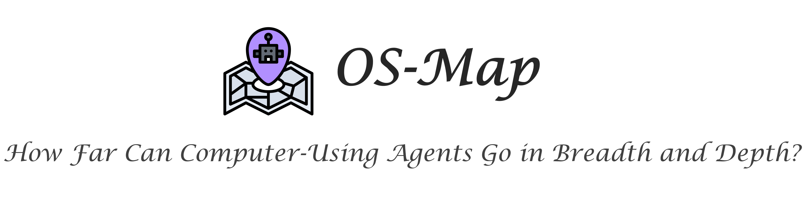

# OSMap

<p align="center">
  
</p>

## 💾 Environment Preparation

The _**OS-Map**_ evaluation environment and agent execution loop run on the local host machine, while observation and action execution take place inside an Ubuntu virtual machine.
To set up _**OS-Map**_, follow these steps:

1. Clone this repository on your host machine and set up the required Python environment.

2. Install VMware, the virtual machine management tool.

3. Download the Ubuntu virtual machine image provided in this repository, which includes all necessary files and system configurations for running the tasks.

> **Note:** The _**OS-Map**_ environment is fully inherited from **[OSWorld](https://arxiv.org/abs/2404.07972)**, with the differences being the virtual machine image and task configurations.
> This section is adapted from the **Installation** section of the OSWorld repository.
> For a more detailed and comprehensive setup guide, please refer to the original [repository](https://github.com/xlang-ai/OSWorld?tab=readme-ov-file#-installation).

### Python Runtime

```bash
# Clone the repository
# If failed, try to click "Download Repository" in the top-right corner
git clone https://anonymous.4open.science/r/OSMap-C2F5

# Change directory into the cloned repository
cd OSWorld

# Optional: Create a Conda environment for OSWorld
# conda create -n osmap python=3.9
# conda activate osmap

# Install required dependencies
pip install -r requirements.txt
```

### VMware

Install [VMware Workstation Pro](https://www.vmware.com/products/workstation-pro/workstation-pro-evaluation.html) and configure the `vmrun` command. The installation process can refer to [How to install VMware Worksation Pro](https://github.com/xlang-ai/OSWorld/desktop_env/providers/vmware/INSTALL_VMWARE.md). Verify the successful installation by running the following:

```bash
vmrun -T ws list
```

If the installation along with the environment variable set is successful, you will see the message showing the current running virtual machines.

> **Compatibility Notice:** Currently, we only provide a virtual machine image compatible with x86-based machines and VMWare Workstation. Support for ARM-based devices, including Apple Silicons and [VMware Fusion](https://support.broadcom.com/group/ecx/productdownloads?subfamily=VMware+Fusion)), is under active testing and development. In addition to VMware, alternative deployment methods (e.g., running the environment inside Docker) are also on our development roadmap.

### Virtual Machine Image

No worries — running the python code in the next **Quick Start** section will automatically download and set up the Ubuntu virtual machine image for you.
Alternatively, you can manually download the image from the huggingface dataset of **_OS-Map_** into the `vmware_vm_data` directory and unzip it.

```bash
# Create the directory for the vm
mkdir -p vmware_vm_data
cd vmware_vm_data

# Manually download the image and extract it.
# It will take some time (~21 GB).
wget https://huggingface.co/datasets/os-map/OSMAP/resolve/main/Ubuntu0.zip
unzip Ubuntu0.zip
```

Once done, you can start the virtual machine by running the following command:

```bash
vmrun -T ws start vmware_vm_data/Ubuntu0/Ubuntu0.vmx
```

If everything is set up correctly, VMware should launch the virtual machine and display the desktop screen.

## 🚀 Quick Start

Run the following minimal example to interact with the environment:

```python
from desktop_env.desktop_env import DesktopEnv

example = {
    "id": "94d95f96-9699-4208-98ba-3c3119edf9c2",
    "instruction": "I want to install Spotify on my current system. Could you please help me?",
    "config": [
        {
            "type": "execute",
            "parameters": {
                "command": [
                    "python",
                    "-c",
                    "import pyautogui; import time; pyautogui.click(960, 540); time.sleep(0.5);"
                ]
            }
        }
    ],
    "evaluator": {
        "func": "check_include_exclude",
        "result": {
            "type": "vm_command_line",
            "command": "which spotify"
        },
        "expected": {
            "type": "rule",
            "rules": {
                "include": ["spotify"],
                "exclude": ["not found"]
            }
        }
    }
}

env = DesktopEnv(action_space="pyautogui")

obs = env.reset(task_config=example)
obs, reward, done, info = env.step("pyautogui.rightClick()")
```

You will see all the logs of the system running normally, including the successful creation of the environment, completion of setup, and successful execution of actions. In the end, you will observe a successful right-click on the screen, which means you are ready to go.

## 🧾 Tasks Overview

All OS-Map tasks are located in the examples directory, organized into subdirectories by application.
There are 15 application-specific subdirectories in total: 14 for single-application tasks and 1 for multi-application tasks, containing 416 real-world and diverse task configurations.

Within each subdirectory, each task is defined by a single JSON file. The filename indicates the task objective and its difficulty level (ranging from _l1_ to _l4_).

Each JSON file includes the following fields:

- `id`: Task identifier (same as the filename)

- `instruction`: Natural language description of the task goal

- `config`: Initialization operations to be executed before the agent starts

- `evaluator`: Configuration for evaluating the agent after execution, consisting of:

  - `post_config`: Post-execution settings applied before evaluation

  - `func`: A list of functions used to compare agent results against expectations

  - `result`: The actual outputs or states extracted from the virtual machine

  - `expected`: The reference values used for comparison
